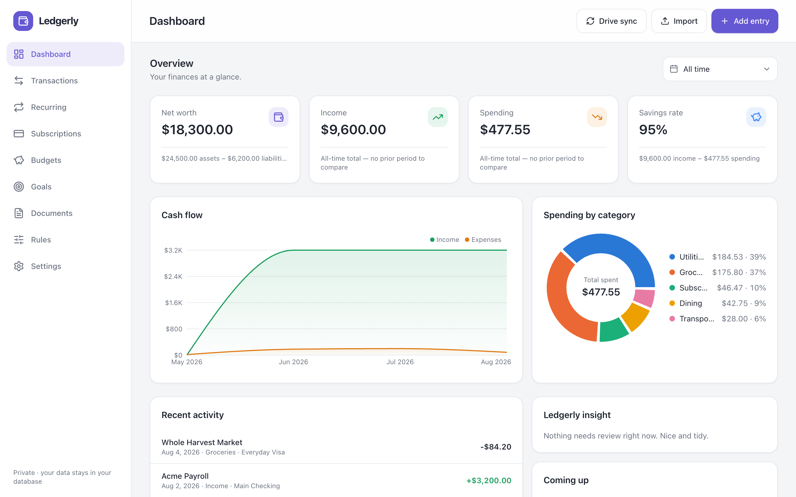
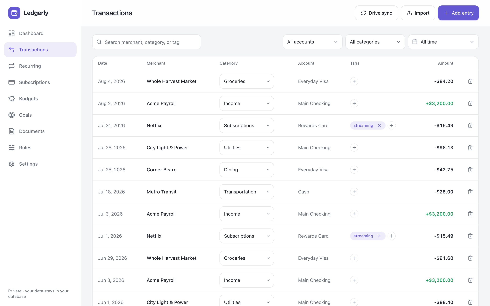
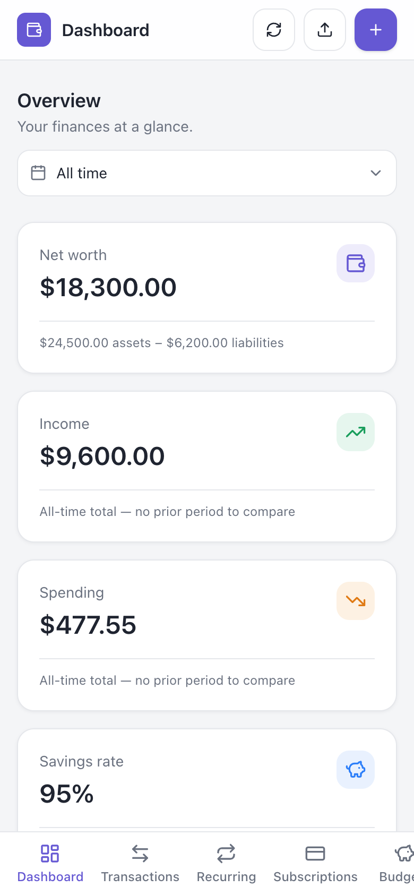

# Ledgerly

[](https://github.com/chennurivarun/ledgerly/actions/workflows/ci.yml)
[](LICENSE)

**Private, self-hosted personal finance — your data in your own Cloudflare
account, never anyone else's.**

Ledgerly is a full personal-finance dashboard that deploys to *your*
Cloudflare account: transactions in your own D1 database, receipts and
statements in your own R2 bucket, served by a Worker you control. No vendor
sits between you and your money data. No telemetry. No sample data. No
guessing.



## Features

- **Dashboard** — net worth, income/spending, savings rate, cash-flow and
  category charts, all driven by a persisted period selector. Trends only
  render when real data supports them; nothing is ever invented.
- **Transactions** — search/filter, inline category and tag editing, manual
  entry, delete with confirmation.
- **Imports that never guess** — CSV statements with column-mapping preview,
  sign-convention confirmation for ambiguous exports, strict rejection of
  unparseable rows, and duplicate-proof fingerprinting across every import
  path (manual, CSV, documents, sync API).
- **Recurring & subscription detection** — a deterministic, unit-tested
  engine (median-interval classification, false-positive guards) that
  *suggests*; you confirm or ignore, it never auto-creates.
- **Budgets, goals, rules, documents** — monthly budgets with real spend,
  savings goals, plain-language categorization rules, and a document vault
  storing original receipt/statement bytes.
- **30 display currencies**, a first-run setup wizard, mobile-friendly
  layouts, and a type-`DELETE` full data-erase that actually erases.

| | |
|---|---|
|  |  |

*Screenshots show demo data added and removed during capture — a fresh
install starts completely empty, by design.*

## Quick start (local)

```bash
git clone <this-repo> ledgerly && cd ledgerly
npm install
npm run dev
```

Open http://localhost:5173. Everything runs locally (Workers runtime with
local D1/R2 via miniflare); data persists in `.wrangler/state/`. No
Cloudflare account is needed — the only feature that requires one is the
Workers AI receipt-extraction provider, which has no local simulator and is
disconnected in local dev unless you opt in with
`LEDGERLY_REMOTE_BINDINGS=true` after authenticating (`npx wrangler login`
or `CLOUDFLARE_API_TOKEN`).

## Deploy to your own Cloudflare account

1. `npx wrangler login`
2. `npx wrangler d1 create ledgerly` → paste the `database_id` into
   [wrangler.jsonc](wrangler.jsonc)
3. `npx wrangler r2 bucket create ledgerly-documents`
4. `npm run deploy`
5. **Privacy step (required):** the app has no login screen by design — put
   the deployed Worker behind [Cloudflare Access](https://developers.cloudflare.com/cloudflare-one/policies/access/)
   (Zero Trust → Applications) so only you can reach it.

The free tiers of Workers, D1, and R2 are far more than a personal finance
app needs.

### AI document reading (optional)

Settings → AI lets Ledgerly suggest transactions from stored documents. Two
shapes:

- **Receipt extraction** — one receipt or invoice becomes one suggested
  transaction with per-field confidence and a review form.
- **PDF statement extraction** — one bank/card statement becomes a whole
  batch of proposed rows in a triage table: select, edit, and import the
  rows you want; duplicates arrive pre-flagged and unchecked; rows the AI
  couldn't fully read can't be imported until you fill the gap; a statement
  too long to read completely says so instead of pretending. (Anthropic
  provider only — Workers AI models can't read PDFs yet. CSV statements
  still import deterministically and stay the recommended path.)

Two providers, off by default:

- **Workers AI** — processed by Workers AI inside your own Cloudflare
  account, never sent to a third-party vendor. Works automatically on
  deployed Workers; in local dev it needs Cloudflare auth plus
  `LEDGERLY_REMOTE_BINDINGS=true` (see [vite.config.ts](vite.config.ts)) —
  without that, everything else still runs fully locally.
- **Anthropic (bring your own key)** — higher accuracy; sends document images
  to Anthropic's API under your key. The key is stored in your database,
  write-only, and never displayed again. Works in local dev with no
  Cloudflare auth.

Extraction only ever *suggests* — you review and confirm every transaction,
and the same duplicate detection applies as for any other import.

### Scheduled imports

`GET/POST /api/drive-sync` implements a complete import contract
(processed-file ledger, reset fencing, 20 MB limits, duplicate
fingerprints) for any scheduled runner you authorize — set the `SYNC_TOKEN`
secret (`npx wrangler secret put SYNC_TOKEN`) to require a bearer token.

## Principles

1. **Your data stays in your infrastructure.** Default deployment is your
   own Cloudflare account; nothing phones home.
2. **Deterministic money math, AI assist.** Totals, dedupe, and detection are
   deterministic and tested. AI features suggest — they never silently write.
3. **Never guess.** Ambiguity asks; uncertainty goes to review.
4. **Empty starts empty.** No sample data, no fake trends, no dark patterns.

## Roadmap

Receipt extraction and PDF statement extraction are shipped. Next up:
**categorization that learns from your corrections** (repeated manual fixes
become rules you approve), then cash-flow forecasting and a read-only MCP
server so your own AI client can chat with your finances. The full direction
is in **[docs/VISION.md](docs/VISION.md)**, with the market research behind
it in [docs/research/](docs/research/).

## Contributing

See [CONTRIBUTING.md](CONTRIBUTING.md). The product spec lives in
[docs/SPEC.md](docs/SPEC.md); tests run with `npm test`.

## License

[AGPL-3.0](LICENSE). You can self-host, modify, and redistribute freely; if
you offer a modified Ledgerly as a network service, you must share your
changes under the same license.
